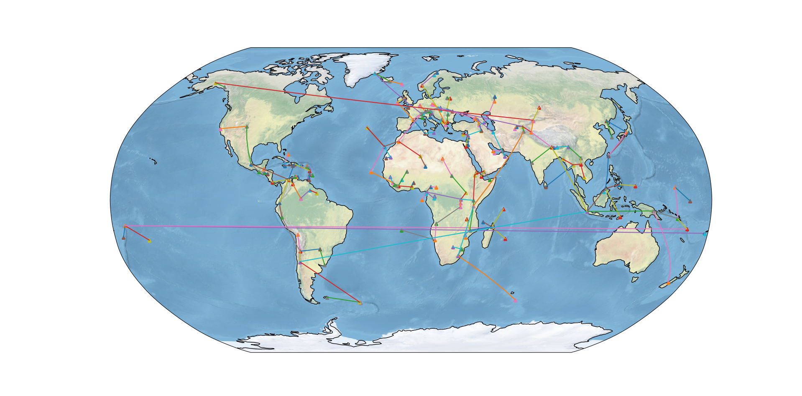

# MountainIsolationMap
Generates a world map with the highest mountain of every country and a graph that connects each mountain to its dominator.

## Graph
Vertices are mountains.
Two mountain `A` is connected to mountain `B` iff `B` is the closest mountain to `A` that has a greater elevation.

## Dependencies
The data is loaded from [Wikidata](https://www.wikidata.org). The map is generated using [matplotlib](https://matplotlib.org/), [cartopy](https://scitools.org.uk/cartopy) and [Shapely](https://pypi.org/project/Shapely/).

## Preview

